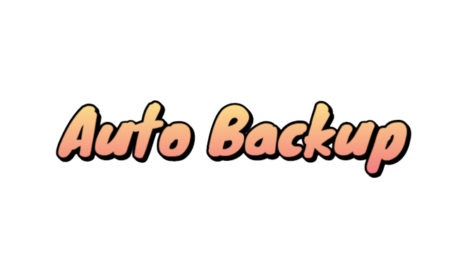

<div align="center">
  
</div>

[](https://github.com/BlockMagicDev/AutoBackup/blob/main/LICENSE)
[](#status)
[](#total)

# Getting started
A project to help schedule backups for google drive and also to automatically turn off/on the PocketMine-MP server when backing up.

# Features

- Schedule automatic backups
- Backup by Google Drive


# Installation

1. Clone the repository.

```shell
git clone https://github.com/BlockMagicDev/AutoBackup
```

2. Config Command/Task File

You go to the folder cloned in step 1, select the Scheduler folder, open each file in that folder and change `USERNAME` to the name of your computer, `Path` to the path to the Scheduler folder of the AutoBackup repository.

**TIP:** If you want to automatically turn on/off the PocketMine-MP server you need to similarly edit all the files contained in the Command folder.

3. Import backup file to Task Scheduler

```shell
taskschd.msc
```
Once you have opened the Task Scheduler with the above command, import all the task files located in the `Scheduler` folder you just edited in step 2.

4. Download google drive and 7Zip

- Download Google Drive

You can download the GoogleDrive.exe file for Windows [here](https://www.google.com/drive/download/)

Once you have downloaded and installed google drive, log in to your account if you already have an account or create a new one!

- Download 7Zip

You can download the 7Zip.exe file for Windows [here](https://www.7-zip.org/download.html)


5. Make Backup Folder

You create a folder with the name `Backups` and `BackupData` in the AutoBackup repository.

```shell
cd AutoBackup
mkdir Backups
mkdir BackupData
```

The `BackupData` folder will contain the files that you need to backup to google drive

6. Complete

Open Google Drive > Settings > Preferences > Choose My Computer > Add Folder and select the `BackupData` folder created in step 5.

# How it works?

When the backup time is scheduled at `Task Scheduler`. first, windows will open Google Drive and execute delzip.bat in `Command` folder (if you have extra setup for PocketMine-MP it will do stop_server.bat before delzip.bat), then it do file compression present in the `BackupData` folder and go to the `Backups` folder then Google Drive will automatically download the compressed file located in the `Backups` folder, when the upload is finished windows will automatically shut down Google Drive (if you have extra setup for PocketMine-MP it will automatically open start_server.bat)
